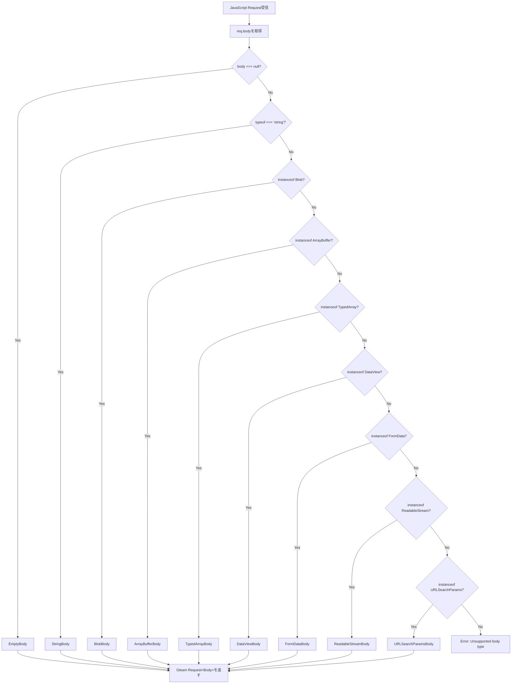
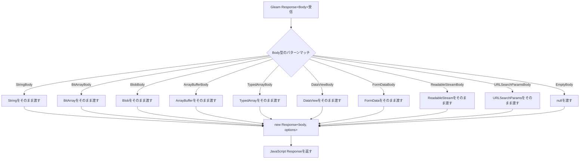

# 技術設計ドキュメント: Flexible Body Types

## 概要

**目的**: HinotoのJavaScriptランタイム実装において、Request/ResponseのbodyをString型に固定せず、MDN仕様に準拠した全てのbody型（Blob、ArrayBuffer、TypedArray、DataView、FormData、ReadableStream、URLSearchParams、String、null）をサポートする。これにより、開発者はバイナリデータ、ストリーム、フォームデータなど多様なデータ形式を扱えるようになる。

**ユーザー**: Hinotoを使用してWebアプリケーション、API、サーバーレス関数を構築する開発者が、画像アップロード、ファイルダウンロード、ストリーミングAPI、フォーム処理などの機能を実装する際に利用する。

**影響**: 現在String型に固定されているbody処理を、Gleamの型システムとJavaScript FFIを通じて柔軟な型システムに拡張する。既存のString/BitArray型のコードは後方互換性を維持しながら、新しいbody型が利用可能になる。

### ゴール

- MDN仕様に準拠した9種類のbody型（Blob、ArrayBuffer、TypedArray、DataView、FormData、ReadableStream、URLSearchParams、String、null）をサポート
- 全JavaScriptランタイム（Node.js、Deno、Bun、Cloudflare Workers、WinterJS）で一貫した動作を実現
- Gleamの型システムでbody型を表現し、コンパイル時の型安全性を確保
- 既存のString/BitArray型のコードとの後方互換性を100%維持

### 非ゴール

- Erlang/Mistランタイムへの対応（JavaScriptターゲットのみが対象）
- カスタムbody型の追加（MDN仕様外の型は対象外）
- 自動型変換機能（開発者が明示的に型を指定する必要がある）
- パフォーマンス最適化の完全な実装（初期バージョンでは正確性を優先、最適化は後のフェーズで実施）

## アーキテクチャ

### 既存アーキテクチャ分析

Hinotoは現在、以下のアーキテクチャパターンを採用している：

- **ランタイム分離パターン**: 各JavaScriptランタイム（Node.js、Deno、Bun、Workers、WinterJS）に対応するモジュールを`src/hinoto/runtime/`配下に配置
- **FFI変換レイヤー**: JavaScript FFI関数（`ffi.*.mjs`）でJavaScript Request/Response ↔ Gleam Request/Responseを変換
- **型パラメータ化**: `Hinoto(context, body)`型で、contextとbodyを型パラメータとして抽象化
- **Promise-based非同期**: JavaScript targetでは`Promise`型を使用した非同期処理

**現在のbody処理フロー**:
```
JavaScript Request
  ↓ await req.text() (String化)
  ↓ toGleamRequest()
Gleam Request(String)
  ↓ handler()
Gleam Response(String)
  ↓ to*Response()
  ↓ new Response(body)
JavaScript Response
```

**維持すべきパターン**:
- ランタイムごとのFFIモジュール分離
- `toGleamRequest` / `to*Response`という命名規則
- Promise-based非同期処理
- 型パラメータによる柔軟性

**拡張ポイント**:
- FFI関数でbody型を判別し、適切に変換
- Gleam側でbody型を表現する新しい型定義
- 既存のString型処理との互換性維持

### ハイレベルアーキテクチャ

```mermaid
graph TB
    subgraph "JavaScript Runtime Layer"
        JSReq[JavaScript Request<br/>body: BodyInit]
        JSResp[JavaScript Response<br/>body: BodyInit]
    end

    subgraph "FFI Conversion Layer"
        FFIReq[toGleamRequest<br/>body type detection]
        FFIResp[to*Response<br/>body serialization]
    end

    subgraph "Gleam Type System"
        BodyType[Body型<br/>String | BitArray | Blob | ...]
        GleamReq[Request&lt;Body&gt;]
        GleamResp[Response&lt;Body&gt;]
    end

    subgraph "Application Handler"
        Handler[User Handler Function]
    end

    JSReq --> FFIReq
    FFIReq --> GleamReq
    GleamReq --> Handler
    Handler --> GleamResp
    GleamResp --> FFIResp
    FFIResp --> JSResp
```

**アーキテクチャ統合**:
- **既存パターンの保持**: ランタイム分離、FFI変換レイヤー、型パラメータ化を維持
- **新コンポーネントの根拠**: Body型定義とFFI変換ロジックの拡張が必要
- **技術スタック適合**: Gleamの型システム、JavaScript FFI、Promiseベースの非同期処理に適合
- **ステアリング準拠**: コードスタイル規約（snake_case、型注釈）、アーキテクチャパターン（FFI分離）に準拠

### 技術スタック整合性

**既存技術スタックとの整合**:
- **Gleam言語**: 型パラメータとカスタム型でbody型を表現
- **JavaScript FFI**: `instanceof`演算子でbody型を判別、適切に変換
- **Promise**: 非同期body読み取り（`arrayBuffer()`, `blob()`等）をPromiseで処理
- **gleam_http**: Request/Response型の`body`型パラメータを活用

**新規依存関係**:
なし（既存のGleam標準ライブラリとJavaScript組み込みAPIのみを使用）

**既存パターンからの逸脱**:
なし（現在のアーキテクチャパターンを拡張するのみ）

### 主要な設計判断

#### 判断1: Body型の表現方法

**決定**: Gleamのカスタム型でBody型を定義し、各バリアントがJavaScriptのbody型に対応する

**コンテキスト**: Gleamの型システムでJavaScriptの複数のbody型を表現する必要がある。Gleamは静的型付け言語であり、型安全性を保ちながらJavaScriptの動的な型を扱う必要がある。

**代替案**:
1. **Opaque型として定義し、JavaScript側で型判別** - 型安全性が低く、コンパイル時の型チェックができない
2. **String/BitArrayのみでbody型を表現** - 全てのbody型をString/BitArrayに変換する必要があり、元の型情報が失われる
3. **カスタム型でバリアントを定義** - 型安全性が高く、コンパイル時の型チェックが可能

**選択されたアプローチ**:
```gleam
pub type Body {
  StringBody(String)
  BitArrayBody(BitArray)
  BlobBody(JsBlob)
  ArrayBufferBody(JsArrayBuffer)
  TypedArrayBody(JsTypedArray)
  DataViewBody(JsDataView)
  FormDataBody(JsFormData)
  ReadableStreamBody(JsReadableStream)
  URLSearchParamsBody(JsURLSearchParams)
  EmptyBody
}
```

各JavaScript型はOpaque型として定義し、FFI経由でのみ操作可能にする。

**根拠**:
- **型安全性**: Gleamのパターンマッチングでbody型を安全に処理できる
- **明示性**: 各バリアントが対応するJavaScript型を明確に示す
- **拡張性**: 将来的に新しいbody型を追加する場合も、バリアントを追加するだけで対応可能
- **後方互換性**: StringBody/BitArrayBodyバリアントで既存コードとの互換性を維持

**トレードオフ**:
- **利点**: 型安全性、明示性、拡張性、後方互換性
- **犠牲**: JavaScript側でインスタンス判別のオーバーヘッド、各ランタイムでのFFI実装コスト

#### 判断2: FFI変換戦略

**決定**: JavaScript側でbody型を判別し、Gleam側でカスタム型のバリアントとして変換する

**コンテキスト**: JavaScript RequestのbodyプロパティはBodyInit型で、実行時に複数の型のいずれかになる。Gleam側で適切な型として扱うために、FFI層で型判別と変換が必要。

**代替案**:
1. **Gleam側で型判別** - GleamはJavaScript型を直接判別できないため、FFIで型情報を渡す必要がある
2. **JavaScript側で型判別し、Gleam側に型情報を渡す** - 型情報の受け渡しが複雑になり、型安全性が低下する
3. **JavaScript側で型判別し、適切なバリアントに変換して返す** - シンプルで型安全性が高い

**選択されたアプローチ**:
```javascript
export async function toGleamRequest(req) {
  const url = new URL(req.url);
  const body = await detectAndConvertBody(req);

  return {
    method: req.method.toUpperCase(),
    headers: convertHeaders(req.headers),
    body: body, // Body型のバリアント
    // ... other fields
  };
}

async function detectAndConvertBody(req) {
  const rawBody = req.body;

  if (rawBody === null) return { type: 'EmptyBody' };
  if (typeof rawBody === 'string') return { type: 'StringBody', value: rawBody };
  if (rawBody instanceof Blob) return { type: 'BlobBody', value: rawBody };
  if (rawBody instanceof ArrayBuffer) return { type: 'ArrayBufferBody', value: rawBody };
  // ... other types
}
```

**根拠**:
- **型安全性**: JavaScript側で型判別し、Gleam側で型安全なバリアントとして受け取れる
- **パフォーマンス**: `instanceof`演算子による高速な型判別
- **可読性**: FFI層で型判別ロジックが集約され、Gleam側はパターンマッチングで処理するだけ

**トレードオフ**:
- **利点**: 型安全性、パフォーマンス、可読性
- **犠牲**: FFI層の実装複雑度が増加、各ランタイムで同じ型判別ロジックを実装する必要がある

#### 判断3: 後方互換性の維持方法

**決定**: Body型のStringBody/BitArrayBodyバリアントを使用し、既存のRequest(String)/Response(String)を内部的にBody型に変換する

**コンテキスト**: 既存のHinotoユーザーはRequest(String)/Response(String)を使用しており、破壊的変更なしに新機能を導入する必要がある。

**代替案**:
1. **Request(String)を廃止し、Request(Body)のみにする** - 破壊的変更となり、既存コードが動作しなくなる
2. **Request(String)とRequest(Body)を別々に提供する** - APIが重複し、保守コストが増加する
3. **Request(body)の型パラメータを拡張し、String/BitArray/Bodyすべてを受け入れる** - 型システムが複雑になり、型安全性が低下する
4. **内部的にStringをBodyに変換し、外部APIは変更しない** - 既存コードが動作し、新機能も利用可能

**選択されたアプローチ**:
- 既存の`Request(String)`/`Response(String)`をそのまま保持
- 新しい`Request(Body)`/`Response(Body)`を追加
- FFI層で`String`を`StringBody(String)`に自動変換
- ユーザーは必要に応じて`Request(Body)`を使用できる

**根拠**:
- **後方互換性**: 既存コードが変更なしで動作
- **段階的移行**: ユーザーは必要に応じて新しいBody型に移行できる
- **型安全性**: 既存のString型と新しいBody型の両方が型安全に扱われる

**トレードオフ**:
- **利点**: 後方互換性、段階的移行、型安全性
- **犠牲**: APIが増加し、ドキュメントで両方のAPIを説明する必要がある

## システムフロー

### リクエスト処理フロー（Body型判別）



### レスポンス変換フロー（Gleam → JavaScript）



## 要件トレーサビリティ

| 要件 | 要件概要 | コンポーネント | インターフェース | フロー |
|------|----------|----------------|------------------|--------|
| 1.1-1.9 | 複数のBody型サポート（Request） | FFI Conversion Layer | `toGleamRequest()` | リクエスト処理フロー |
| 2.1-2.9 | 複数のBody型サポート（Response） | FFI Conversion Layer | `to*Response()` | レスポンス変換フロー |
| 3.1-3.6 | 全ランタイムでの一貫性 | Runtime Modules (node, deno, bun, workers, winterjs) | Runtime-specific FFI functions | - |
| 4.1-4.4 | Gleam型システム統合 | Gleam Type System | Body型定義、Request/Response型 | - |
| 5.1-5.4 | 後方互換性維持 | FFI Conversion Layer, Gleam Type System | StringBody/BitArrayBodyバリアント | - |
| 6.1-6.4 | エラーハンドリング | FFI Conversion Layer | Error detection in `detectAndConvertBody()` | - |
| 7.1-7.4 | パフォーマンス最適化 | FFI Conversion Layer | Zero-copy転送、instanceof高速判別 | - |
| 8.1-8.4 | ドキュメントと例 | Documentation | API docs、examples/ | - |

## コンポーネントとインターフェース

### FFI変換レイヤー

#### Body型判別モジュール

**責任と境界**
- **主要責任**: JavaScript RequestのbodyプロパティからBody型のバリアントを判別し、Gleam側に適切な型で渡す
- **ドメイン境界**: JavaScript ↔ Gleam間のFFI層、body型変換のみを担当
- **データ所有権**: JavaScript Requestのbodyプロパティを読み取り、Gleam Request型に変換したデータを返す
- **トランザクション境界**: 単一のリクエスト処理内で完結（非同期だがトランザクショナルではない）

**依存関係**
- **インバウンド**: 各ランタイムモジュール（node.gleam、deno.gleam等）からtoGleamRequest関数を経由して呼び出される
- **アウトバウンド**: なし（JavaScriptの組み込みAPI（instanceof演算子、Request API）のみを使用）
- **外部**: なし（標準JavaScript APIのみ）

**契約定義**

**サービスインターフェース**:
```typescript
interface BodyDetector {
  // JavaScript RequestのbodyをGleam Body型に変換
  // 前提条件: reqはJavaScript Requestオブジェクト
  // 事後条件: Body型のバリアントを返す、または対応していない型の場合はエラー
  detectAndConvertBody(req: Request): Promise<Body>;
}

type Body =
  | { type: 'StringBody', value: string }
  | { type: 'BitArrayBody', value: ArrayBuffer }
  | { type: 'BlobBody', value: Blob }
  | { type: 'ArrayBufferBody', value: ArrayBuffer }
  | { type: 'TypedArrayBody', value: TypedArray }
  | { type: 'DataViewBody', value: DataView }
  | { type: 'FormDataBody', value: FormData }
  | { type: 'ReadableStreamBody', value: ReadableStream }
  | { type: 'URLSearchParamsBody', value: URLSearchParams }
  | { type: 'EmptyBody' };
```

- **前提条件**:
  - `req`はJavaScript Request APIに準拠したオブジェクト
  - `req.body`は読み取り可能な状態（まだ消費されていない）
- **事後条件**:
  - 成功時: Body型のバリアントを返す
  - 失敗時: エラーメッセージを含むエラーを返す
- **不変条件**:
  - body型の判別順序は常に同じ（null → string → Blob → ...）
  - body is consumed after detection（検出後はbodyが消費される）

**統合戦略**:
- **変更アプローチ**: 既存の`toGleamRequest`関数を拡張し、`detectAndConvertBody`を呼び出す
- **後方互換性**: 既存のString型処理は`StringBody`バリアントとして保持
- **移行パス**: 既存コードは変更不要、新機能を使う場合のみBody型を使用

#### Body変換モジュール（Response）

**責任と境界**
- **主要責任**: Gleam ResponseのBody型をJavaScript Responseのbodyプロパティに変換する
- **ドメイン境界**: Gleam ↔ JavaScript間のFFI層、response body変換のみを担当
- **データ所有権**: Gleam Response型のbodyを読み取り、JavaScript Responseオブジェクトを生成して返す
- **トランザクション境界**: 単一のレスポンス処理内で完結

**依存関係**
- **インバウンド**: 各ランタイムモジュール（node.gleam、deno.gleam等）からto*Response関数を経由して呼び出される
- **アウトバウンド**: なし（JavaScriptの組み込みResponse APIのみを使用）
- **外部**: なし（標準JavaScript APIのみ）

**契約定義**

**サービスインターフェース**:
```typescript
interface BodyConverter {
  // Gleam Body型をJavaScript Response bodyに変換
  // 前提条件: bodyはGleam Body型のバリアント
  // 事後条件: JavaScript Responseに渡せる形式のbodyを返す
  convertBodyToJS(body: Body): BodyInit | null;
}
```

- **前提条件**:
  - `body`はGleam Body型の有効なバリアント
- **事後条件**:
  - 成功時: JavaScript Response constructorに渡せるBodyInit型を返す
  - EmptyBodyの場合: nullを返す
- **不変条件**:
  - 変換は決定的（同じ入力に対して常に同じ出力）
  - 元のbodyデータは変更されない（immutable）

**統合戦略**:
- **変更アプローチ**: 既存の`to*Response`関数を拡張し、`convertBodyToJS`を呼び出す
- **後方互換性**: StringBody/BitArrayBodyは既存の処理をそのまま使用
- **移行パス**: 既存コードは変更不要、新しいBody型を使う場合のみ新しい変換ロジックが動作

### Gleam型システム

#### Body型定義

**責任と境界**
- **主要責任**: JavaScript body型をGleamの型システムで表現し、型安全なbody処理を実現する
- **ドメイン境界**: Gleam型システム層、body型の定義と型パラメータ化のみを担当
- **データ所有権**: Body型のバリアントを所有し、Request/Response型に型パラメータとして渡す
- **トランザクション境界**: 該当なし（型定義のみ）

**依存関係**
- **インバウンド**: Request/Response型、ハンドラ関数からBody型が使用される
- **アウトバウンド**: なし（型定義のみ）
- **外部**: なし（Gleam標準ライブラリの型のみ）

**契約定義**

Gleamでの型定義:
```gleam
/// JavaScript body型を表現するGleam型
pub type Body {
  /// String型のbody（テキストデータ）
  StringBody(String)

  /// BitArray型のbody（バイナリデータ）
  BitArrayBody(BitArray)

  /// Blob型のbody（ファイル、画像等）
  BlobBody(JsBlob)

  /// ArrayBuffer型のbody（固定長バイナリデータ）
  ArrayBufferBody(JsArrayBuffer)

  /// TypedArray型のbody（型付き配列）
  TypedArrayBody(JsTypedArray)

  /// DataView型のbody（ArrayBufferのビュー）
  DataViewBody(JsDataView)

  /// FormData型のbody（フォームデータ）
  FormDataBody(JsFormData)

  /// ReadableStream型のbody（ストリーミングデータ）
  ReadableStreamBody(JsReadableStream)

  /// URLSearchParams型のbody（URLクエリパラメータ）
  URLSearchParamsBody(JsURLSearchParams)

  /// 空のbody
  EmptyBody
}

/// JavaScript Blob型のOpaque型
pub type JsBlob

/// JavaScript ArrayBuffer型のOpaque型
pub type JsArrayBuffer

/// JavaScript TypedArray型のOpaque型
pub type JsTypedArray

/// JavaScript DataView型のOpaque型
pub type JsDataView

/// JavaScript FormData型のOpaque型
pub type JsFormData

/// JavaScript ReadableStream型のOpaque型
pub type JsReadableStream

/// JavaScript URLSearchParams型のOpaque型
pub type JsURLSearchParams
```

**状態管理**:
- **状態モデル**: Immutable（不変）、バリアントの変更はできない
- **永続化**: なし（メモリ上のみ）
- **並行性**: なし（Immutableなので同時アクセスの問題はない）

**統合戦略**:
- **変更アプローチ**: 新しい型定義を追加、既存のRequest/Response型を拡張しない
- **後方互換性**: 既存のRequest(String)/Response(String)はそのまま維持、新しくRequest(Body)/Response(Body)を追加
- **移行パス**: ユーザーは必要に応じてRequest(Body)を使用、既存コードは変更不要

### ランタイムモジュール

#### Node.jsランタイム

**責任と境界**
- **主要責任**: Node.js環境でHinotoを実行するためのFFI関数を提供
- **ドメイン境界**: Node.jsランタイム層、Node.js固有のサーバー起動とリクエスト/レスポンス変換のみを担当
- **データ所有権**: Node.js Request/Responseを受け取り、Gleam Request/Responseに変換して返す
- **トランザクション境界**: 単一のHTTPリクエスト/レスポンス処理内で完結

**依存関係**
- **インバウンド**: Gleamアプリケーションコードから`node.serve()`関数が呼び出される
- **アウトバウンド**: `@hono/node-server`ライブラリ、FFI Conversion Layerの`toGleamRequest`/`toNodeResponse`関数
- **外部**: `@hono/node-server`（Node.js HTTPサーバーアダプター）

**外部依存関係調査**:
- **@hono/node-server**: Hono WebフレームワークのNode.jsアダプター
  - **バージョン**: 最新安定版（package.jsonに記載）
  - **API**: `serve({ fetch, port }, callback)` - Honoのfetchハンドラを受け取りNode.jsサーバーを起動
  - **認証フロー**: なし（HTTPサーバーのみ、認証はアプリケーション層で実装）
  - **レート制限**: なし（アプリケーション層で実装する必要がある）
  - **互換性**: Node.js 18以上（Fetch API対応）
  - **既知の問題**: ポート衝突時のエラーハンドリングは実装済み（ffi.node.mjsのserve関数）

**契約定義**

**サービスインターフェース**:
```gleam
pub fn handler(
  app_handler: fn(Hinoto(Nil, Body)) -> Promise(Hinoto(Nil, Body)),
) -> fn(JsRequest) -> Promise(JsResponse)

pub fn start_server(
  fetch: fn(JsRequest) -> Promise(JsResponse),
  port: Option(Int),
  callback: Option(fn(Info) -> Nil),
) -> Nil
```

- **前提条件**:
  - `app_handler`はPromiseを返すハンドラ関数
  - `port`が指定される場合、1024-65535の有効なポート番号
- **事後条件**:
  - サーバーが起動し、指定されたポートでリクエストを受け付ける
  - エラー時は適切なエラーメッセージを出力
- **不変条件**:
  - サーバーは一度起動したら停止するまで実行され続ける
  - 各リクエストは独立して処理される

**統合戦略**:
- **変更アプローチ**: 既存の`toGleamRequest`/`toNodeResponse`関数を拡張し、Body型をサポート
- **後方互換性**: 既存のString型ハンドラはそのまま動作
- **移行パス**: Body型を使う場合は新しいハンドラシグネチャを使用

#### その他ランタイム（Deno、Bun、Workers、WinterJS）

Node.jsランタイムと同様の責任・境界・契約を持ち、各ランタイム固有のFFI実装を提供する。

- **Deno**: `Deno.serve()`を使用してHTTPサーバーを起動
- **Bun**: `Bun.serve()`を使用してHTTPサーバーを起動
- **Cloudflare Workers**: Worker環境でfetchイベントハンドラを登録
- **WinterJS**: WinterJS環境でHTTPリクエストを処理

すべてのランタイムで共通の`toGleamRequest`/`to*Response`インターフェースを実装し、Body型の判別・変換ロジックを統一する。

## データモデル

### ドメインモデル

**コアコンセプト**:

- **Body（集約ルート）**: Request/Responseのbodyを表現する値オブジェクト
  - **エンティティ**: なし（全て値オブジェクト）
  - **値オブジェクト**: StringBody、BlobBody、ArrayBufferBody等（9種類のバリアント）
  - **ドメインイベント**: なし（bodyの変換は副作用のない純粋な操作）

**ビジネスルールと不変条件**:
- Body型のバリアントは不変（Immutable）
- 各バリアントは対応するJavaScript型と1:1で対応
- EmptyBodyはnullに対応し、bodyが存在しないことを表現
- StringBody/BitArrayBodyは既存のString/BitArray型との後方互換性を保つ

**集約間の整合性戦略**:
- 該当なし（単一の値オブジェクトのみ）

### 論理データモデル

**構造定義**:

```
Body型
├─ StringBody(String)           : テキストデータ
├─ BitArrayBody(BitArray)       : バイナリデータ（Gleam）
├─ BlobBody(JsBlob)             : バイナリデータ（JavaScript）
├─ ArrayBufferBody(JsArrayBuffer) : 固定長バイナリデータ
├─ TypedArrayBody(JsTypedArray)   : 型付き配列
├─ DataViewBody(JsDataView)       : ArrayBufferのビュー
├─ FormDataBody(JsFormData)       : フォームデータ
├─ ReadableStreamBody(JsReadableStream) : ストリーミングデータ
├─ URLSearchParamsBody(JsURLSearchParams) : URLクエリパラメータ
└─ EmptyBody                      : 空のbody
```

**エンティティ関係と基数**:
- Request型とBody型: 1対1（各Requestは1つのBodyを持つ）
- Response型とBody型: 1対1（各Responseは1つのBodyを持つ）

**自然キーと識別子**:
- なし（値オブジェクトなので識別子は不要）

**整合性と完全性**:
- **トランザクション境界**: 単一のリクエスト/レスポンス処理内で完結
- **カスケーディングルール**: なし
- **時間的側面**: なし（バージョニングや監査は対象外）

### 物理データモデル

該当なし（Hinotoはデータベースを使用せず、メモリ上でのデータ変換のみを行う）

### データ契約と統合

**APIデータ転送**:

JavaScript → Gleam（Request）:
```typescript
{
  method: string,
  headers: List<[string, string]>,
  body: Body, // Body型のバリアント
  scheme: string,
  host: string,
  port: number,
  path: string,
  query: string | undefined
}
```

Gleam → JavaScript（Response）:
```typescript
{
  status: number,
  headers: List<[string, string]>,
  body: BodyInit | null // JavaScript Response APIのbody型
}
```

**バリデーションルール**:
- body型は9種類のバリアントのいずれか、またはEmptyBody
- JavaScript側でbody型を判別し、対応するバリアントに変換
- 対応していないbody型の場合はエラーを返す

**シリアライゼーション形式**:
- JSON（該当なし、bodyは生のバイナリデータまたはテキストデータ）
- 各body型は対応するJavaScript型のシリアライゼーション形式を使用

**クロスサービスデータ管理**:
- 該当なし（単一サービス内で完結）

## エラーハンドリング

### エラー戦略

Hinotoのbody型変換では、以下のエラーカテゴリに対応する：

**ユーザーエラー（4xx相当）**:
- **サポートされていないbody型**: ユーザーがMDN仕様外のbody型を使用した場合
- **リカバリ**: エラーメッセージで対応しているbody型をリスト表示

**システムエラー（5xx相当）**:
- **body読み取り失敗**: JavaScript側でreq.body()の読み取りに失敗した場合
- **リカバリ**: エラーログを出力し、500エラーレスポンスを返す

**ビジネスロジックエラー（422相当）**:
- **body型の矛盾**: Content-Typeヘッダーとbody型が一致しない場合（将来的な拡張）
- **リカバリ**: エラーメッセージで正しいContent-Typeを提案

### エラーカテゴリとレスポンス

**サポートされていないbody型（ユーザーエラー）**:
- **検出**: FFI層の`detectAndConvertBody`関数でbody型判別に失敗
- **メッセージ**: `Unsupported body type. Supported types are: String, Blob, ArrayBuffer, TypedArray, DataView, FormData, ReadableStream, URLSearchParams, null`
- **リカバリ**: ユーザーに対応しているbody型を選択するよう促す

**body読み取り失敗（システムエラー）**:
- **検出**: `await req.text()`や`await req.arrayBuffer()`が例外をスロー
- **メッセージ**: `Failed to read request body: [原因]`
- **リカバリ**: 500エラーレスポンスを返し、エラーログを出力

**ランタイム非対応（システムエラー）**:
- **検出**: 特定のランタイムで特定のbody型がサポートされていない場合
- **メッセージ**: `Body type [型名] is not supported in [ランタイム名]`
- **リカバリ**: エラーメッセージで代替手段を提案、または該当ランタイムでの対応を検討

### モニタリング

**エラー追跡**:
- FFI層でエラーが発生した場合、`console.error`でエラーメッセージをログ出力
- エラーメッセージには以下を含む：
  - エラーの種類（body型判別エラー、読み取りエラー等）
  - 発生箇所（ランタイム名、関数名）
  - エラーの原因（body型、例外メッセージ等）

**ロギング**:
- 開発環境: 詳細なエラーログを出力（body型、スタックトレース等）
- 本番環境: 最小限のエラーログを出力（セキュリティ上、詳細な情報は出力しない）

**ヘルスモニタリング**:
- 該当なし（Hinotoはライブラリであり、サービスではないため）
- ユーザーのアプリケーション層でヘルスチェックを実装する必要がある

## テスト戦略

### ユニットテスト

**FFI Conversion Layer**:
1. `detectAndConvertBody`関数の型判別テスト
   - 各body型（String、Blob、ArrayBuffer等）が正しいバリアントに変換されることを検証
   - nullが`EmptyBody`に変換されることを検証
   - サポートされていない型でエラーが返されることを検証

2. `convertBodyToJS`関数の変換テスト
   - 各Bodyバリアントが正しいJavaScript型に変換されることを検証
   - `EmptyBody`がnullに変換されることを検証

3. エラーハンドリングテスト
   - body読み取り失敗時にエラーが返されることを検証
   - サポートされていない型でエラーメッセージが適切に生成されることを検証

**Gleam Type System**:
1. Body型のパターンマッチングテスト
   - 各バリアントがパターンマッチで正しく処理されることを検証

2. Opaque型のFFI統合テスト
   - JsBlob、JsArrayBuffer等のOpaque型がFFI経由で正しく操作できることを検証

### 統合テスト

**ランタイム統合テスト**:
1. Node.jsランタイムでのbody型変換テスト
   - 各body型を含むリクエストを送信し、Gleam側で正しく受け取れることを検証
   - Gleam側で各body型を含むレスポンスを返し、JavaScript側で正しく受け取れることを検証

2. Denoランタイムでのbody型変換テスト
   - Node.jsと同様のテストをDeno環境で実行

3. Bunランタイムでのbody型変換テスト
   - Node.jsと同様のテストをBun環境で実行

4. Cloudflare Workersランタイムでのbody型変換テスト
   - Node.jsと同様のテストをCloudflare Workers環境で実行

5. WinterJSランタイムでのbody型変換テスト
   - Node.jsと同様のテストをWinterJS環境で実行

**後方互換性テスト**:
1. 既存のString型ハンドラが引き続き動作することを検証
2. 既存のBitArray型ハンドラが引き続き動作することを検証

### E2E/UIテスト

該当なし（Hinotoはライブラリであり、UIは存在しない）

### パフォーマンス/負荷テスト

1. **String型のbody変換パフォーマンス**:
   - 既存のString型処理と新しいStringBody処理のパフォーマンスを比較
   - レイテンシとスループットが同等であることを検証

2. **大きなバイナリデータのbody変換パフォーマンス**:
   - 10MBのBlobをリクエストbodyとして送信し、変換時間を測定
   - メモリコピーが最小限であることを検証

3. **ReadableStreamのストリーミング処理パフォーマンス**:
   - ストリーミングデータを送受信し、メモリ使用量を測定
   - バッファリングが適切に行われることを検証

4. **並行リクエスト処理の負荷テスト**:
   - 1000並行リクエストを送信し、すべてが正しく処理されることを検証
   - レイテンシとスループットが許容範囲内であることを検証

## セキュリティ考慮事項

### 脅威モデリング

**脅威1: 過大なbodyサイズによるDoS攻撃**:
- **リスク**: 攻撃者が非常に大きなbody（例: 1GB）を送信し、サーバーのメモリを枯渇させる
- **対策**: アプリケーション層でbodyサイズ制限を実装するようドキュメントで推奨
- **実装**: Hinotolライブラリ自体では制限を設けず、ユーザーがミドルウェアで実装

**脅威2: Content-Type偽装攻撃**:
- **リスク**: 攻撃者がContent-Typeヘッダーを偽装し、予期しないbody型を送信する
- **対策**: body型判別をContent-Typeではなく、実際のJavaScript型で行う
- **実装**: `instanceof`演算子で実際の型を判別

**脅威3: ReadableStreamの無限ストリーム攻撃**:
- **リスク**: 攻撃者が終了しないReadableStreamを送信し、サーバーリソースを消費し続ける
- **対策**: アプリケーション層でタイムアウトを設定するようドキュメントで推奨
- **実装**: Hinotoライブラリ自体ではタイムアウトを設けず、ユーザーがミドルウェアで実装

### セキュリティコントロール

**入力検証**:
- body型の判別時に、サポートされている型のみを許可
- サポートされていない型はエラーとして拒否

**データ保護**:
- body データはメモリ上でのみ処理され、永続化されない
- TLS/HTTPS通信はランタイム層で実装されるため、Hinotoライブラリでは対応不要

**認証と認可**:
- 該当なし（Hinotoはリクエスト/レスポンス変換のみを担当、認証はアプリケーション層で実装）

### コンプライアンス要件

該当なし（Hinotoはオープンソースライブラリであり、特定のコンプライアンス要件はない）

ユーザーがGDPR、HIPAA等のコンプライアンス要件を満たす必要がある場合、アプリケーション層で適切な対策を実装する必要がある。

## パフォーマンスとスケーラビリティ

### ターゲットメトリクス

**レイテンシ**:
- **String型body変換**: 既存実装と同等（< 1ms）
- **バイナリデータbody変換**: 10MB以下のデータで < 10ms
- **ストリーム処理**: バッファリング遅延 < 50ms

**スループット**:
- **同時リクエスト処理**: 1000並行リクエストで既存実装の90%以上のスループット

**メモリ使用量**:
- **バイナリデータ処理**: ゼロコピー変換により、メモリコピーを最小化
- **ストリーム処理**: バッファリングサイズを制限し、メモリ使用量を抑制

### スケーリングアプローチ

**水平スケーリング**:
- Hinotoライブラリ自体はステートレスなので、水平スケーリングに対応
- ユーザーのアプリケーションをコンテナ化し、ロードバランサーで分散

**垂直スケーリング**:
- CPU: body型判別とパターンマッチングはCPU負荷が低いため、垂直スケーリングは不要
- メモリ: バイナリデータ処理時にメモリ使用量が増加するため、必要に応じてメモリを増強

### キャッシング戦略とパフォーマンス最適化

**キャッシング**:
- 該当なし（Hinotoはリクエスト/レスポンス変換のみを担当、キャッシングはアプリケーション層で実装）

**パフォーマンス最適化**:
1. **ゼロコピー変換**: ArrayBuffer、TypedArray等のバイナリデータはコピーせずに参照を渡す
2. **instanceof高速判別**: body型判別に`instanceof`演算子を使用し、高速に型を判別
3. **遅延評価**: ReadableStreamは必要になるまで読み取らず、遅延評価を活用
4. **早期リターン**: EmptyBodyやStringBodyは早期に判別し、不要な処理をスキップ
