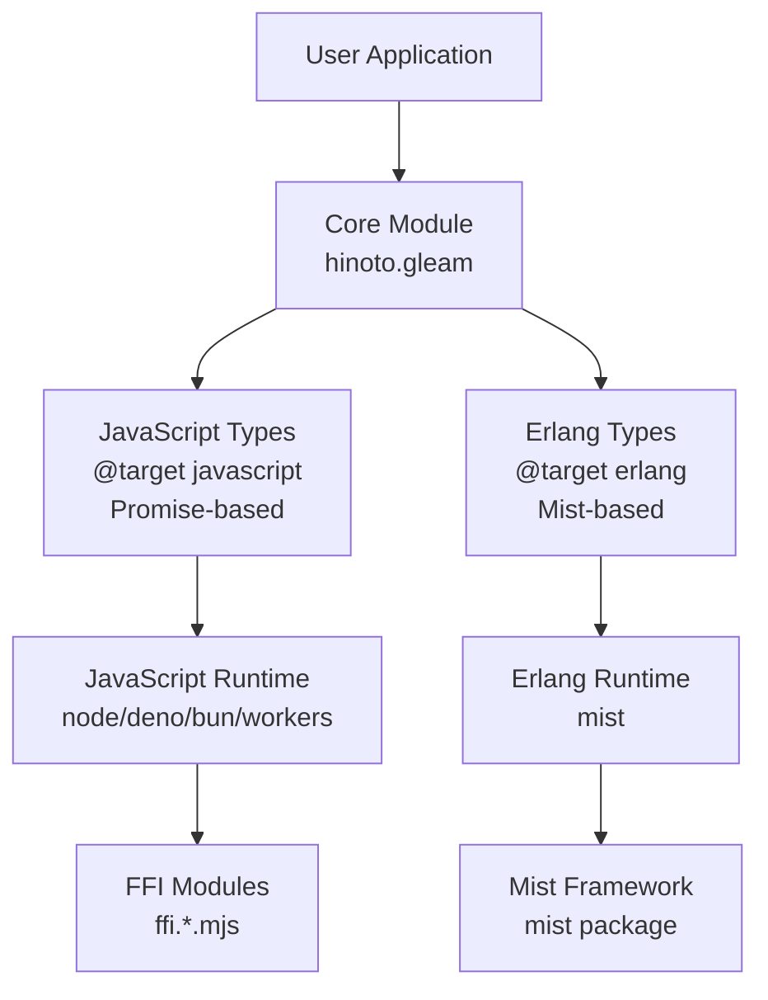
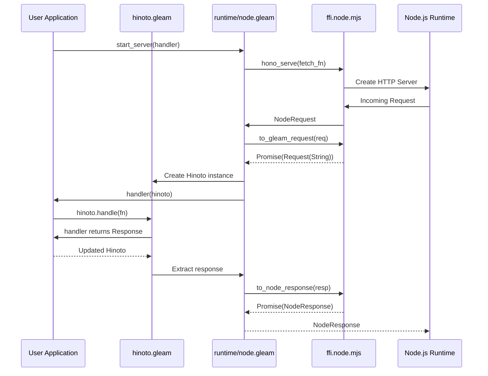
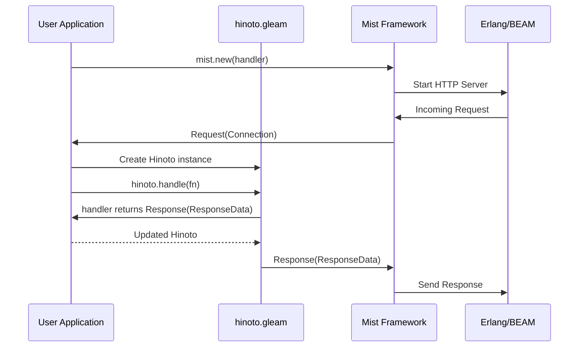
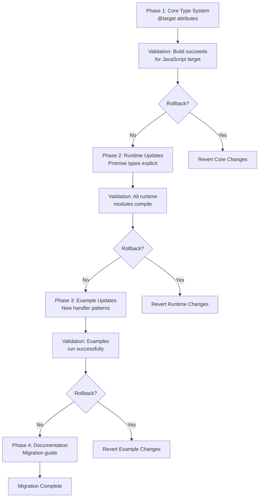

# Technical Design: Target-Based Async Types

## Overview

この機能は、Gleamの`@target`属性を活用してJavaScriptとErlangターゲットで異なる非同期型システムを実装します。JavaScriptターゲットでは`Promise`ベースの非同期APIを提供し、ErlangターゲットではMistフレームワークの`Connection`と`ResponseData`型を使用します。これにより、Hinotoフレームワークはそれぞれのエコシステムに最適化された自然なAPIを提供し、真のマルチターゲット対応Webフレームワークとなります。

**Purpose:** 開発者がJavaScriptとErlangの両方のターゲットで、各プラットフォームの慣用的なパターンに従ってHinotoアプリケーションを記述できるようにします。

**Users:**
- JavaScript開発者は`Promise`ベースの非同期APIを使用してNode.js、Deno、Bun、CloudFlare Workersで動作するアプリケーションを構築します
- Erlang開発者はMistフレームワークの型システムを使用してErlang/OTP環境でWebサーバーを構築します

**Impact:** 現在のJavaScriptのみのサポートから、JavaScriptとErlangの両方をサポートするマルチターゲットフレームワークへと進化します。既存のJavaScriptコードベースは最小限の変更で新しい型システムに移行できます。

### Goals

- Gleamの`@target`属性を使用したターゲット別型定義システムの実装
- JavaScriptターゲットで`Promise`ベースの非同期APIの提供
- ErlangターゲットでMistフレームワークの型システム（`Request(Connection)` → `Response(ResponseData)`）への準拠
- コアロジックの共通化とターゲット固有コードの明示的な分離
- すべてのexampleプロジェクトの新しい型システムへの更新

### Non-Goals

- 既存APIの破壊的変更（後方互換性を100%維持）
- パフォーマンス最適化（機能実装に焦点）
- 他のターゲット（例：WASM）のサポート
- Mist以外のErlangサーバーフレームワークの実装（設計では考慮、実装は将来のフェーズ）

## Architecture

### Existing Architecture Analysis

Hinotoは現在、以下のアーキテクチャパターンに従っています：

**モジュラーモノリス構造:**
- **コアモジュール** (`src/hinoto.gleam`): 型定義とハンドラーロジック
- **ランタイムモジュール** (`src/hinoto/runtime/`): JavaScript専用の実装
- **FFIレイヤー**: 各ランタイム用の`.mjs`ファイル

**現在の制約:**
- すべての非同期処理が`Promise`型に依存
- `Hinoto`型は`Hinoto(context, body)`として汎用的に定義されているが、実際にはJavaScript専用
- ランタイムモジュールは`@target(javascript)`属性のみを使用

**維持すべき統合ポイント:**
- `gleam/http`の`Request`と`Response`型との互換性
- 既存のFFI実装パターン
- `use`構文を活用したエルゴノミックなAPI

**技術的負債の対応:**
- 現在の`handle`関数は同期的な`fn(Request(body)) -> Response(body)`のみをサポート
- JavaScriptターゲットで`Promise`を返すハンドラーが自然に表現できない
- 解決策: 既存の`handle`を維持しつつ、新しく`handle_async`関数を追加して後方互換性を確保

### High-Level Architecture



**Architecture Integration:**

- **既存パターンの保持**:
  - モジュラーモノリス構造を維持
  - `Hinoto(context, body)`型の汎用性を活用
  - `use`構文によるエルゴノミックなAPI

- **新規コンポーネントの根拠**:
  - `@target`属性による型エイリアスでターゲット別の型を提供
  - ターゲット別`handle`関数でPromiseとMistの違いを吸収

- **技術スタックとの整合性**:
  - 既存の`gleam_javascript`、`gleam_http`との互換性維持
  - 新規依存関係として`mist`を追加（Erlangターゲットのみ）

- **ステアリング準拠**:
  - Runtime Isolation: ターゲット固有コードを`@target`で分離
  - Minimal FFI: Gleam型システムで最大限実装
  - Type Safety: コンパイル時に適切な型を選択

### Technology Alignment

この機能は既存のHinoroの技術スタックに以下のように統合されます：

**既存技術との整合性:**
- **Gleam言語機能**: `@target`属性を活用した条件付きコンパイル
- **gleam_http**: `Request`と`Response`型を引き続き使用
- **gleam_javascript**: JavaScriptターゲットでのFFI実装

**新規依存関係:**
- **mist** (Erlangターゲットのみ): ErlangでのHTTPサーバー実装
  - バージョン: 最新安定版（`gleam.toml`で指定）
  - 使用理由: GleamのErlangエコシステムで標準的なWebサーバーフレームワーク

**既存パターンからの逸脱:**
なし。既存のモジュール構造、FFIパターン、API設計を維持し、`@target`属性を追加するのみ。

### Key Design Decisions

#### Decision 1: @target属性による型エイリアスの分岐

**Context:**
現在の`handle`関数は`fn(Request(body)) -> Response(body)`という同期的なシグネチャを持ちますが、JavaScriptの非同期処理には`Promise`が必要で、Erlangでは同期的だがMist固有の型が必要です。

**Alternatives:**
1. **型パラメータでの抽象化**: `Hinoto(context, req_body, resp_body)`のように型パラメータを増やす
2. **別モジュールでの実装**: `hinoto/javascript`と`hinoto/erlang`で完全に分離
3. **@target属性による型エイリアス**: コア型定義を共通化し、ターゲット別に型エイリアスで分岐

**Selected Approach:**
`@target`属性を使用して型エイリアスを定義します：

```gleam
// JavaScript target
@target(javascript)
pub type AsyncResponse(body) = Promise(Response(body))

@target(javascript)
pub type Handler(context, body) =
  fn(Hinoto(context, body)) -> Hinoto(context, body)

// Erlang target
@target(erlang)
pub type AsyncResponse = Response(ResponseData)

@target(erlang)
pub type MistHandler(context) =
  fn(Hinoto(context, Connection)) -> Hinoto(context, ResponseData)
```

**Rationale:**
- 単一のコアモジュールでターゲット別の実装を提供できる
- ユーザーコードは`AsyncResponse`や`Handler`型を使用するだけでターゲットに応じた適切な型が解決される
- 既存の`Hinoto`型定義を変更せずに拡張できる
- Gleamのコンパイラが未使用のターゲット用コードを削除するため、バンドルサイズが最適化される

**Trade-offs:**
- **Gain**: 型安全性を保ちながらコード共有を最大化、ユーザーAPIはシンプル
- **Sacrifice**: 型定義が複数のターゲットに分散し、ドキュメントで説明が必要

#### Decision 2: handleの関数をターゲット別実装で直接Promise対応に書き換え

**Context:**
JavaScriptでは`Promise`を返すハンドラー、Erlangでは同期的だがMist型を使用するハンドラーが必要です。既存の`handle`関数を直接書き換え、シンプルなAPIを維持します。

**Alternatives:**
1. **既存handleを保持して新関数を追加**: API複雑度が増加、2つの関数を使い分ける必要がある
2. **既存handleを直接書き換え**: シンプルなAPI、破壊的変更だが明確
3. **バージョン番号で分岐**: 過度に複雑

**Selected Approach:**
`@target`属性で`handle`関数のターゲット別実装を直接提供：

```gleam
// JavaScriptターゲット - Promise対応
@target(javascript)
pub fn handle(
  hinoto: Hinoto(context, body),
  handler: fn(Request(body)) -> Promise(Response(body))
) -> Hinoto(context, body) {
  // 内部でuseを使ってPromiseをwrap
  use response <- promise.await(handler(hinoto.request))
  set_response(hinoto, response)
}

// Erlangターゲット - 同期的だがインターフェース統一
@target(erlang)
pub fn handle(
  hinoto: Hinoto(context, body),
  handler: fn(Request(body)) -> Response(body)
) -> Hinoto(context, body) {
  set_response(hinoto, handler(hinoto.request))
}
```

**Rationale:**
- 単一の`handle`関数でターゲットに応じた適切な実装を提供
- APIがシンプルで学習コストが低い
- 内部で`use`構文を使ってPromiseチェーンを構築し、ユーザーコードを簡潔に保つ
- Erlangターゲットでも同じ`handle`関数名でインターフェースを統一
- `@target`属性によりコンパイル時に適切な実装が選択される

**Trade-offs:**
- **Gain**: シンプルで一貫性のあるAPI、ターゲット間の統一的なインターフェース、学習コストの最小化
- **Sacrifice**: 既存のJavaScriptコードへの破壊的変更（同期的handleから非同期handleへ）、マイグレーションが必要

#### Decision 3: Erlangターゲットでも汎用的なbody型パラメータを維持

**Context:**
Mistフレームワークは`Request(Connection)`と`Response(ResponseData)`という特定の型を要求しますが、JavaScriptとErlangで共通の`Hinoto(context, body)`型を使えるようにし、コードの一貫性を保つ必要があります。

**Alternatives:**
1. **Erlangターゲットで型パラメータを削減**: `Hinoto(context)`にして型パラメータ数を変更（破壊的変更）
2. **汎用的なbody型パラメータを維持**: JavaScriptもErlangも同じ`Hinoto(context, body)`を使用
3. **新しい型を定義**: `HinotoMist(context)`を別途作成（型の分裂）

**Selected Approach:**
Erlangターゲットでも`Hinoto(context, body)`型を維持し、型エイリアスで制約：

```gleam
// JavaScript Target - bodyは汎用的
@target(javascript)
pub type Hinoto(context, body) {
  Hinoto(
    request: Request(body),
    response: Response(body),
    context: context
  )
}

// Erlang Target - bodyは汎用的だが、Mist使用時は型推論で制約
@target(erlang)
pub type Hinoto(context, body) {
  Hinoto(
    request: Request(body),
    response: Response(body),
    context: context
  )
}

// Mistランタイム使用時の型エイリアス（ユーザー向けヘルパー）
@target(erlang)
pub type HinotoMist(context) = Hinoto(context, mist.Connection)
```

**Rationale:**
- JavaScriptとErlangで同じ`Hinoto(context, body)`型を使用し、コードの一貫性を確保
- Mist使用時は`HinotoMist(context)`型エイリアスで簡潔に表現できる
- 既存の型パラメータ構造を維持し、破壊的変更を回避
- 将来的にMist以外のErlangサーバーフレームワーク（Elli、Cowboyなど）もサポート可能

**Trade-offs:**
- **Gain**: JavaScriptとErlangでの型一貫性、破壊的変更なし、拡張性の確保
- **Sacrifice**: Mist使用時に`body`型を明示的に指定する必要がある（型エイリアスで軽減）

## System Flows

### JavaScript Target: Promise-Based Request Handling



### Erlang Target: Mist-Based Request Handling



## Components and Interfaces

### Core Layer

#### Core Module (`src/hinoto.gleam`)

**Responsibility & Boundaries:**
- **Primary Responsibility**: ターゲット非依存の型定義とハンドラーロジックを提供
- **Domain Boundary**: HTTP request/responseの抽象化レイヤー
- **Data Ownership**: `Hinoto`型のライフサイクル管理
- **Transaction Boundary**: 単一のrequest-responseサイクル

**Dependencies:**
- **Inbound**: すべてのランタイムモジュール、ユーザーアプリケーション
- **Outbound**: `gleam/http`（Request/Response型）
- **External**: なし（純粋Gleamコード）

**Service Interface:**

```gleam
// ターゲット共通の型定義（JavaScriptもErlangも同じ構造）
pub type Hinoto(context, body) {
  Hinoto(
    request: Request(body),
    response: Response(body),
    context: context
  )
}

// JavaScript target - Promise対応のhandle
@target(javascript)
pub fn handle(
  hinoto: Hinoto(context, body),
  handler: fn(Request(body)) -> Promise(Response(body))
) -> Hinoto(context, body)

// Erlang target - 同期的なhandle（インターフェース統一）
@target(erlang)
pub fn handle(
  hinoto: Hinoto(context, body),
  handler: fn(Request(body)) -> Response(body)
) -> Hinoto(context, body)

// Erlang target - Mist使用時の型エイリアス
@target(erlang)
pub type HinotoMist(context) = Hinoto(context, mist.Connection)

// 共通ヘルパー関数
pub fn set_response(hinoto: Hinoto(context, body), response: Response(body)) -> Hinoto(context, body)
pub fn set_request(hinoto: Hinoto(context, body), request: Request(body)) -> Hinoto(context, body)
pub fn set_context(hinoto: Hinoto(old_context, body), context: new_context) -> Hinoto(new_context, body)
```

**Preconditions:**
- `handle`関数: `Hinoto`インスタンスが有効なrequest/response/contextを持つこと
- ハンドラー関数: 有効な`Request`を受け取り有効な`Response`を返すこと

**Postconditions:**
- `handle`関数: 新しい`Response`で更新された`Hinoto`インスタンスを返す
- エラーは`Result`型やターゲット固有のエラーメカニズムで表現される

**Invariants:**
- `Hinoto`インスタンスはイミュータブル
- 各操作は新しい`Hinoto`インスタンスを返す
- context、request、responseの整合性が常に保たれる

**Integration Strategy:**
- **Modification Approach**: 既存の`handle`関数を直接Promise対応に書き換え、`@target`属性でターゲット別実装を提供
- **Breaking Changes**: JavaScriptターゲットで`handle`関数のシグネチャが変更（同期→非同期）
- **Migration Path**:
  1. `handle`関数を`@target`属性付きで分岐実装
  2. Erlang向けの`HinotoMist`型エイリアスを追加
  3. 既存のJavaScriptコードはPromise対応のハンドラーに書き換えが必要

### Runtime Layer

#### JavaScript Runtime Modules

**Responsibility & Boundaries:**
- **Primary Responsibility**: JavaScript特有のランタイム（Node.js、Deno、Bun、Workers）とHinotoコアの橋渡し
- **Domain Boundary**: JavaScriptランタイムのFFI境界
- **Data Ownership**: ランタイム固有の`Request`/`Response`型の変換

**Dependencies:**
- **Inbound**: ユーザーアプリケーション
- **Outbound**: `hinoto`コアモジュール、`gleam/javascript/promise`
- **External**: `@hono/node-server` (Node.js), Deno/Bun/Workers APIs

**Service Interface:**

```gleam
// src/hinoto/runtime/node.gleam
@target(javascript)
pub type NodeRequest

@target(javascript)
pub type NodeResponse

@target(javascript)
pub fn handler(
  app_handler: fn(Hinoto(Nil, String)) -> Hinoto(Nil, String)
) -> fn(NodeRequest) -> Promise(NodeResponse)

@target(javascript)
pub fn to_gleam_request(req: NodeRequest) -> Promise(Request(String))

@target(javascript)
pub fn to_node_response(resp: Response(String)) -> Promise(NodeResponse)

pub fn start_server(
  fetch: fn(NodeRequest) -> Promise(NodeResponse),
  port: Option(Int),
  callback: Option(fn(Info) -> Nil)
) -> Nil
```

同様のインターフェースが`deno.gleam`、`bun.gleam`、`workers.gleam`、`winterjs.gleam`にも存在します。

**注**: 現在の実装では`to_gleam_request`と`to_node_response`の両方が`Promise`を返します。この一貫性を設計でも維持します。

**Integration Strategy:**
- **Modification Approach**: 既存の実装を維持、型シグネチャは**既に正しい**ため変更不要
- **Backward Compatibility**: 既存のFFI実装とAPI構造を**一切変更しない**
- **Migration Path**: 実装コードは変更不要、ドキュメント更新のみ

#### Erlang Runtime Module (新規)

**Responsibility & Boundaries:**
- **Primary Responsibility**: MistフレームワークとHinotoコアの**疎結合な**統合
- **Domain Boundary**: ErlangランタイムとMist APIの境界（将来的にElli、Cowboyなど他のサーバーフレームワークも同様の構造でサポート可能）
- **Data Ownership**: Mistの`Connection`と`ResponseData`型の管理
- **疎結合の方針**: JavaScriptのランタイムモジュールと同様、Mistランタイムモジュールは独立したモジュールとして実装し、コアモジュールに依存を持ち込まない

**Dependencies:**
- **Inbound**: ユーザーアプリケーション
- **Outbound**: `hinoto`コアモジュール、`mist`パッケージ
- **External**: Mistフレームワーク（Erlangターゲットでのみ利用可能）

**External Dependencies Investigation:**
- **Mistパッケージ**:
  - 公式ドキュメント: https://hexdocs.pm/mist/
  - GitHub: https://github.com/rawhat/mist
  - 最新バージョン: v5.0.3 (2025年1月時点)
  - APIシグネチャ:
    - `mist.new(handler)`: サーバー作成
    - `mist.bind(server, host)`: ホスト設定
    - `mist.port(server, port)`: ポート設定
    - `mist.start(server)`: サーバー起動
  - 使用される型: `Connection` (opaque)、`ResponseData` (opaque)
  - 制限事項: Erlangターゲットのみで利用可能

**Service Interface:**

```gleam
// src/hinoto/runtime/mist.gleam (新規作成)
// JavaScriptのnode.gleamやworkers.gleamと同様の疎結合な構造
import mist
import gleam/http/request.{type Request}
import gleam/http/response.{type Response}
import gleam/option.{type Option}
import hinoto.{type Hinoto}

@target(erlang)
pub type Connection = mist.Connection

@target(erlang)
pub type ResponseData = mist.ResponseData

@target(erlang)
pub type MistHandler = fn(Request(Connection)) -> Response(ResponseData)

@target(erlang)
pub fn handler(
  app_handler: fn(Hinoto(Nil, Connection)) -> Hinoto(Nil, ResponseData)
) -> MistHandler {
  fn(req: Request(Connection)) {
    let hinoto_instance =
      hinoto.Hinoto(
        request: req,
        response: hinoto.default_response(),
        context: Nil
      )

    app_handler(hinoto_instance).response
  }
}

@target(erlang)
pub fn start_server(
  handler: MistHandler,
  port: Option(Int),
  host: Option(String)
) -> Result(Nil, mist.Error) {
  let port_val = option.unwrap(port, 8000)
  let host_val = option.unwrap(host, "localhost")

  mist.new(handler)
  |> mist.bind(host_val)
  |> mist.port(port_val)
  |> mist.start
}
```

**疎結合設計の実現**:
- JavaScriptランタイムモジュール(`node.gleam`、`workers.gleam`など)と同じ構造パターンを踏襲
- `hinoto`コアモジュールは`mist`パッケージに依存せず、`hinoto/runtime/mist.gleam`が依存を持つ
- 将来的に`hinoto/runtime/elli.gleam`、`hinoto/runtime/cowboy.gleam`など他のErlangサーバーフレームワーク向けモジュールも同様の構造で追加可能
- ユーザーは必要なランタイムモジュールのみをインポートし、不要な依存関係を避けられる

**Preconditions:**
- `start_server`: 有効なハンドラー関数が提供される
- `handler`: `Hinoto`インスタンスを正しく処理する関数

**Postconditions:**
- `start_server`: サーバーが正常に起動するか、`Result`型でエラーを返す
- `handler`: Mist互換の`Response(ResponseData)`を返す

**Invariants:**
- すべての操作でMistの型システムに準拠
- `Connection`と`ResponseData`は不透明型として扱われる

## Data Models

### Domain Model

#### Hinoto型の型パラメータ戦略

**Core Concept:**
`Hinoto`型は2つの型パラメータ`context`と`body`を持ちます。`context`はランタイム固有の実行コンテキスト（例: Cloudflare WorkersのExecutionContext）を、`body`はリクエスト/レスポンスのボディ型を表現します。

**Target-Based Type Constraints:**

```gleam
// JavaScript Target
@target(javascript)
pub type Hinoto(context, body) {
  Hinoto(
    request: Request(body),
    response: Response(body),
    context: context
  )
}
// body は通常 String または任意の型

// Erlang Target
@target(erlang)
pub type Hinoto(context) {
  Hinoto(
    request: Request(Connection),
    response: Response(ResponseData),
    context: context
  )
}
// body は Connection (request) と ResponseData (response) に固定
```

**Business Rules & Invariants:**
- `Hinoto`インスタンスはイミュータブル
- `request`、`response`、`context`の3つのフィールドは常に有効な値を持つ
- ターゲット別に`body`型の制約が異なる（JavaScriptは汎用、ErlangはMist型）
- `context`型はユーザーが自由に定義可能（例: `Nil`、カスタムコンテキスト型）

### Data Contracts & Integration

#### JavaScript Target

**Request/Response Schema:**

```gleam
@target(javascript)
pub type NodeRequest  // FFI opaque type

@target(javascript)
pub type NodeResponse  // FFI opaque type

// Conversion functions
to_gleam_request: fn(NodeRequest) -> Promise(Request(String))
to_node_response: fn(Response(String)) -> Promise(NodeResponse)
```

**Promise Integration:**
- すべての非同期操作は`gleam/javascript/promise.Promise`型を使用
- `promise.await`と`use`構文でPromiseチェーンを構築
- エラーは`Promise`の`reject`として伝播

#### Erlang Target

**Request/Response Schema:**

```gleam
@target(erlang)
pub type Connection = mist.Connection  // Mist opaque type

@target(erlang)
pub type ResponseData = mist.ResponseData  // Mist opaque type

// Mist response constructors
mist.Bytes(bytes_builder: BytesBuilder) -> ResponseData
mist.Chunked(iterator: Iterator(BitArray)) -> ResponseData
mist.send_file(path: String, offset: Int, length: Option(Int)) -> Response(ResponseData)
```

**Mist Integration:**
- `Connection`型はソケット情報とクライアントメタデータを保持
- `ResponseData`型は3つのバリアント（Bytes、Chunked、File）をサポート
- エラーは`Result(T, mist.Error)`型で表現

**Cross-Target Data Management:**
- JavaScriptとErlangで異なる型システムを使用するため、クロスターゲットのデータ共有は行わない
- 共通のビジネスロジックは`body`型に依存しない形で実装
- ターゲット固有の処理は`@target`属性で明示的に分離

## Error Handling

### Error Strategy

Hinotoのエラー処理は、ターゲットごとに異なるエラーメカニズムを採用します。

**JavaScript Target:**
- `Promise`の`reject`でエラーを伝播
- `gleam/result.Result`型で構造化されたエラー情報を提供
- ランタイムモジュールでFFIエラーをキャッチし、Gleamの`Result`型に変換

**Erlang Target:**
- Gleamの`Result(T, E)`型を使用
- Mistの`mist.Error`型をそのまま利用
- Erlang/OTPのプロセスモデルによる耐障害性を活用

### Error Categories and Responses

**User Errors (4xx相当):**
- **Invalid Handler**: ハンドラーが不正な`Response`を返した場合
  - JavaScript: `Promise.reject`でエラーを返す
  - Erlang: `Error(InvalidResponse)`を返す
- **Request Processing Error**: リクエスト処理中の例外
  - JavaScript: ランタイムモジュールでキャッチし、500レスポンスに変換
  - Erlang: Mistがプロセスクラッシュをハンドリング

**System Errors (5xx相当):**
- **FFI Failure**: JavaScript FFI呼び出しの失敗
  - JavaScript: `Promise.reject`で伝播、ランタイムモジュールで500レスポンスに変換
- **Server Start Failure**: サーバー起動の失敗
  - JavaScript: 例外をスロー（アプリケーション起動時のみ）
  - Erlang: `Result(Nil, mist.Error)`を返す

**Business Logic Errors (422相当):**
- **Handler Logic Error**: ユーザー定義ハンドラー内のエラー
  - ユーザーが`Response`で適切なステータスコードとエラーメッセージを返すことを推奨
  - フレームワークはエラーハンドリングを強制しない（柔軟性を重視）

### Monitoring

**Logging Strategy:**
- ランタイムモジュールでサーバー起動時とエラー発生時にログ出力
- 既存の`gleam/io.println`を使用した基本的なログ
- ユーザーがカスタムロガーを統合できるよう拡張ポイントを提供（将来的な拡張）

**Error Tracking:**
- JavaScriptターゲット: `Promise` rejectionをユーザーが捕捉可能
- Erlangターゲット: `Result`型でエラー情報を返す、OTPのerror_loggerと統合

**Health Monitoring:**
- 基本的なサーバー起動/停止のステータス情報
- 詳細なヘルスチェックはユーザーがハンドラーで実装

## Testing Strategy

### Unit Tests

**Core Module Tests:**
- `Hinoto`型の生成とフィールドアクセス
- `set_response`、`set_request`、`set_context`の動作検証
- ターゲット別の型エイリアスが正しくコンパイルされることを確認（JavaScriptとErlangで個別にテスト）
- `handle`関数の基本的な動作（モックハンドラーを使用）

**Runtime Module Tests:**
- JavaScript変換関数（`to_gleam_request`、`to_node_response`など）のユニットテスト
- Promiseチェーンの正しい構築
- エラーハンドリングの検証

**Target-Specific Tests:**
- `gleam test --target javascript`でJavaScriptターゲットのみをテスト
- `gleam test --target erlang`でErlangターゲットのみをテスト

### Integration Tests

**JavaScript Runtime Integration:**
- Node.jsでのサーバー起動と基本的なリクエスト処理
- Denoでのサーバー起動とレスポンス検証
- BunおよびCloudflare Workersでのサンプルアプリ動作確認
- Promiseベースのハンドラーが正しく動作することを確認

**Erlang Runtime Integration (将来):**
- Mistを使用したサーバー起動とリクエスト処理
- `Connection`と`ResponseData`型の正しい変換
- ストリーミングレスポンス（`mist.Chunked`）の動作確認

**Cross-Target Compatibility:**
- 同一のハンドラーロジックがJavaScriptとErlangで動作することを確認
- exampleプロジェクトをビルド・実行してエンドツーエンドの動作を検証

### E2E Tests

**Example Project Tests:**
- `example/node_server`、`example/deno_server`、`example/bun_server`、`example/workers`を実行
- 基本的なHTTPリクエスト（GET、POST）に対するレスポンスを検証
- ルーティング機能が正しく動作することを確認

**Migration Tests:**
- 既存のJavaScriptコードが新しい型システムで動作することを確認
- Promiseを明示的に返すハンドラーが正しく処理されることを検証

### Performance Tests

**Baseline Performance:**
- JavaScriptターゲットでの基本的なリクエスト/レスポンス処理のスループット測定
- Erlangターゲットでの同等のパフォーマンス測定（将来）

**Promise Overhead:**
- Promise変換のオーバーヘッドを測定
- 既存の同期的な実装と比較して著しいパフォーマンス低下がないことを確認

## Migration Strategy

既存のJavaScriptコードベースから新しいターゲット別型システムへの移行は、以下の段階で実施します。



### Phase 1: Core Type System Implementation

**Actions:**
1. `src/hinoto.gleam`の`handle`関数を`@target`属性付きでPromise対応に書き換え
2. Erlang向けに`HinotoMist`型エイリアスを追加
3. `src/hinoto/runtime/mist.gleam`を新規作成（Mistランタイムモジュール）
4. `gleam.toml`に`mist`依存を追加（Erlangターゲット用）
5. ユニットテストを実装
6. **破壊的変更**: 既存の`handle`関数のシグネチャ変更

**Validation:**
- `gleam build --target javascript`が成功すること
- `gleam build --target erlang`が成功すること（`mist`依存を追加後）
- **既存のJavaScriptコードはビルドエラーになる**（意図的な破壊的変更）
- 新しいAPIでユニットテストが通過すること

**Rollback Trigger:**
- 新しい実装でビルドエラーが発生した場合
- ユニットテストが期待通り動作しない場合

### Phase 2: Runtime Module Updates

**Actions:**
1. JavaScriptランタイムモジュール（`node.gleam`、`deno.gleam`など）は**変更不要**（既に正しい実装）
2. ドキュメントコメントの更新のみ（`Promise`の説明を明確化）
3. Mistランタイムモジュールの統合テストを実装

**Validation:**
- すべてのランタイムモジュールがコンパイルできること（変更なしのため問題なし）
- 統合テストが通過すること

**Rollback Trigger:**
- ランタイムモジュールのビルドエラー（**発生しないはず、変更がないため**）
- FFI実装との不整合（**発生しないはず、変更がないため**）

### Phase 3: Example Project Updates

**Actions:**
1. `example/node_server`、`example/deno_server`、`example/bun_server`、`example/workers`を新しいAPIに移行
2. すべてのハンドラーをPromise対応に書き換え
3. ルーティング例を更新
4. 新しくErlang/Mistのexampleプロジェクトを追加
5. E2Eテストを実装

**Validation:**
- 各exampleプロジェクトが正常にビルド・実行できること
- JavaScriptとErlangの両方のexampleが動作すること
- E2Eテストが通過すること

**Rollback Trigger:**
- exampleプロジェクトの動作不良
- 新しいAPIでの実装が不明瞭な場合

### Phase 4: Documentation and Migration Guide

**Actions:**
1. `docs/concepts.md`にターゲット別型定義とPromise対応の説明を追加
2. `docs/quickstart.md`にJavaScriptとErlangターゲットの使用例を追加
3. `README.md`を更新（v2.0.0の破壊的変更を明記）
4. `CHANGELOG.md`に詳細なマイグレーションガイドを記載
5. v1.x → v2.0.0のマイグレーションガイドを作成

**Validation:**
- ドキュメントが正確であること
- マイグレーションガイドに従って既存コードが更新できること
- 破壊的変更が明確に説明されていること

**Rollback Trigger:**
- なし（ドキュメントのみの変更のため）

### Backward Compatibility

**Breaking Changes (v2.0.0への移行):**
- JavaScriptターゲットで`handle`関数のシグネチャが変更
  - **旧**: `fn(Request(body)) -> Response(body)`
  - **新**: `fn(Request(body)) -> Promise(Response(body))`
- 既存のJavaScriptコードは**マイグレーションが必要**

**Preserved Behavior:**
- `Hinoto`型の構造は**変更なし**（`Hinoto(context, body)`）
- ヘルパー関数（`set_response`、`set_request`、`set_context`など）は**完全に変更なし**
- `Hinoto(context, body)`の型パラメータ構造は**JavaScriptもErlangも同じ**
- FFI実装は**一切変更なし**

**Migration Guide:**
既存のJavaScriptコードは以下のように書き換えが必要です：

```gleam
// 旧コード（v1.x）
hinoto
|> handle(fn(req) {
  response.new(200)
  |> response.set_body("Hello")
})

// 新コード（v2.0.0）
hinoto
|> handle(fn(req) {
  promise.resolve(
    response.new(200)
    |> response.set_body("Hello")
  )
})

// または非同期処理を使用
hinoto
|> handle(fn(req) {
  use data <- promise.await(fetch_data())
  response.new(200)
  |> response.set_body(data)
})
```

**Version Strategy:**
- メジャーバージョンアップ（v1.x → v2.0.0）として破壊的変更を明示
- CHANGELOGで詳細なマイグレーションガイドを提供
- exampleプロジェクトをすべて新しいAPIに更新してリファレンスとして提供
